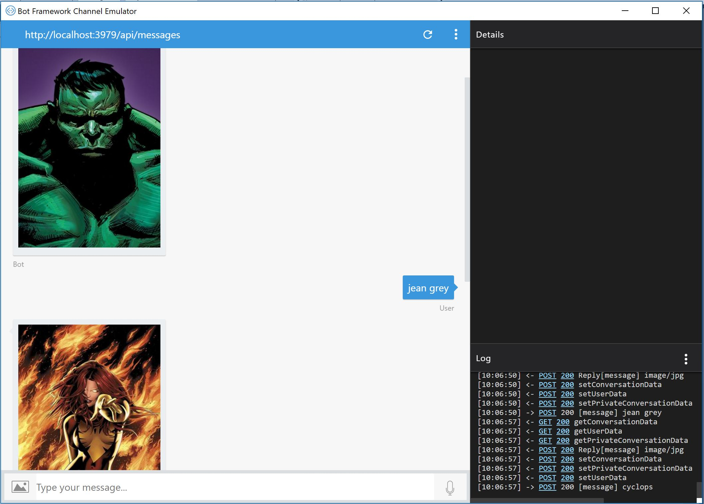
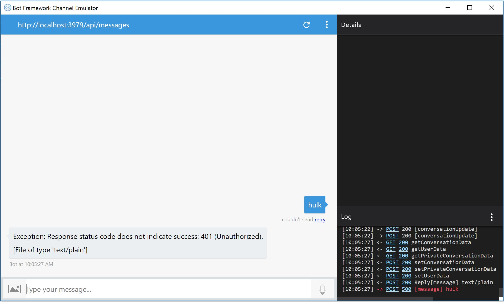

# MarvelBot

La idea de hacer este Bot es hacer una prueba de concepto un poco más práctica acerca de lo que se puede hacer con un Bot. Si apenas comienzas a explorar la herramienta de Bots te recomendaría revisar [este repositorio](https://github.com/aminespinoza/Curso-bots) que te permite avanzar en todos los conceptos básicos de esto.

### Requisitos para este proyecto

Una cuenta de [desarrollador de Marvel Comics](https://developer.marvel.com/).
Un proyecto de Microsoft Bot Framework.
Emulador de Bots (si gustas puedes desde ya ir publicando tu Bot pero esto complicaría mucho las cosas).

## Avances de versiones

**Commit 1:** Proyecto publicado, por ahora el Bot es capaz de recibir las llaves públicas y privadas para generar el hash requerido en el API de Marvel.  
Es capaz de consultar únicamente personajes por nombre, como se ve en la siguiente imagen.

**Notas de interés**
Si al momento de publicar, obtienes una imagen como la siguiente significa que no has puesto tus llaves públicas y privadas.

